# Jejak

**Jejak** (Indonesian for *trail* or *footprint*) is an iOS app for recording runs and walks with GPS. It draws your route, measures distance, pace and elevation gain, and keeps every session on your device. There's no account and no server.

Most of the work went into the tracking. Phone GPS is noisy: it drifts while you stand at a traffic light, jumps across the street, and cuts corners. Jejak passes every fix through a Kalman filter tuned for the activity, so the distance it shows is close to the distance you actually covered.

<p align="center">
  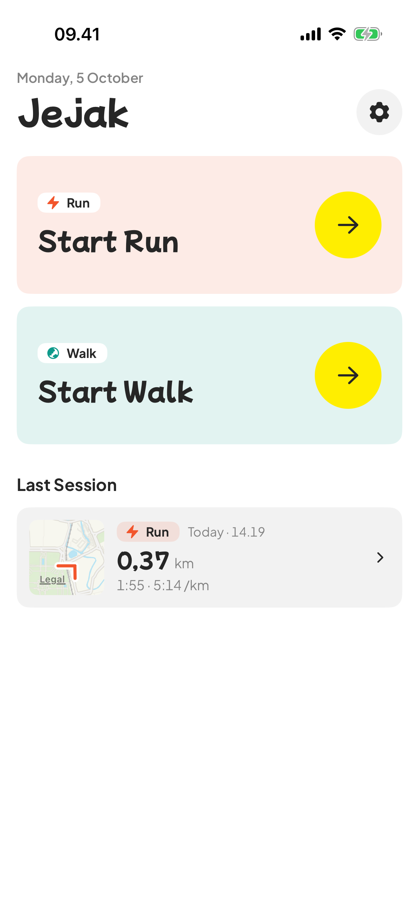
  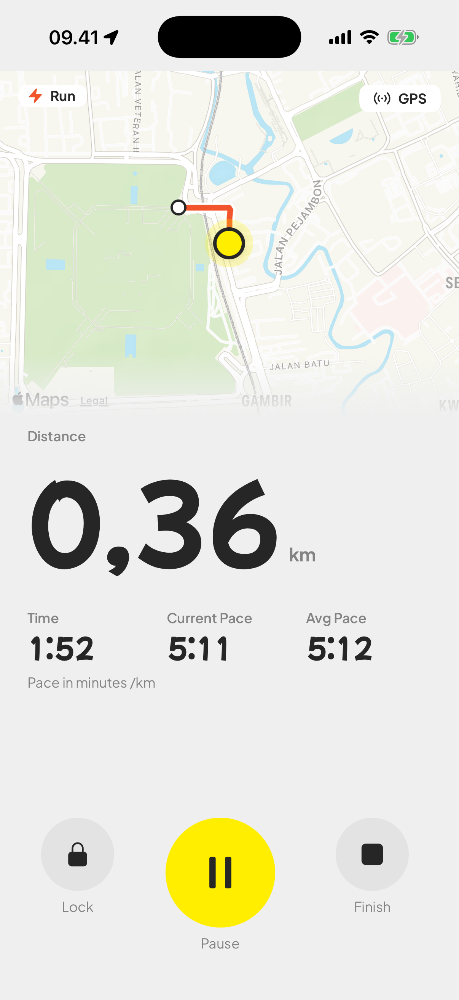
  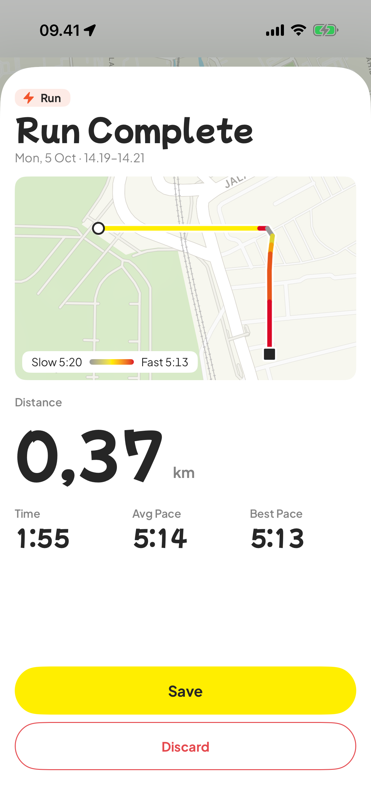
</p>
<p align="center">
  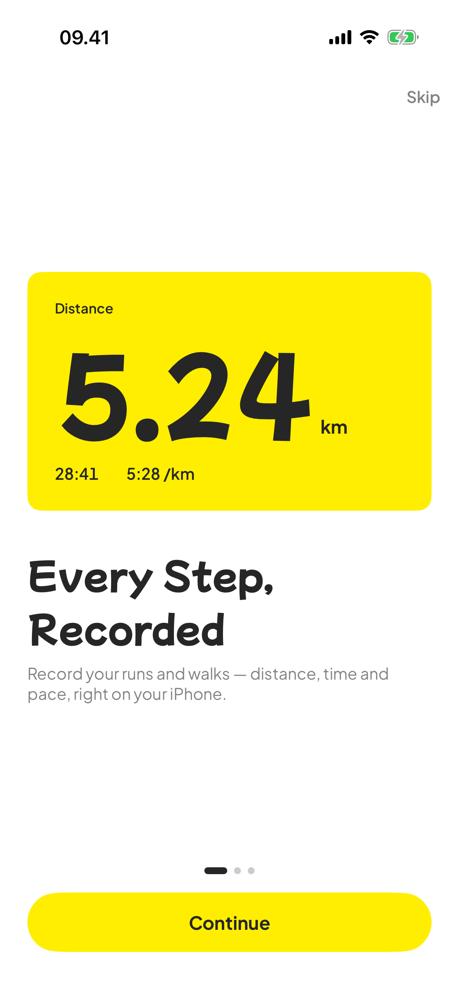
  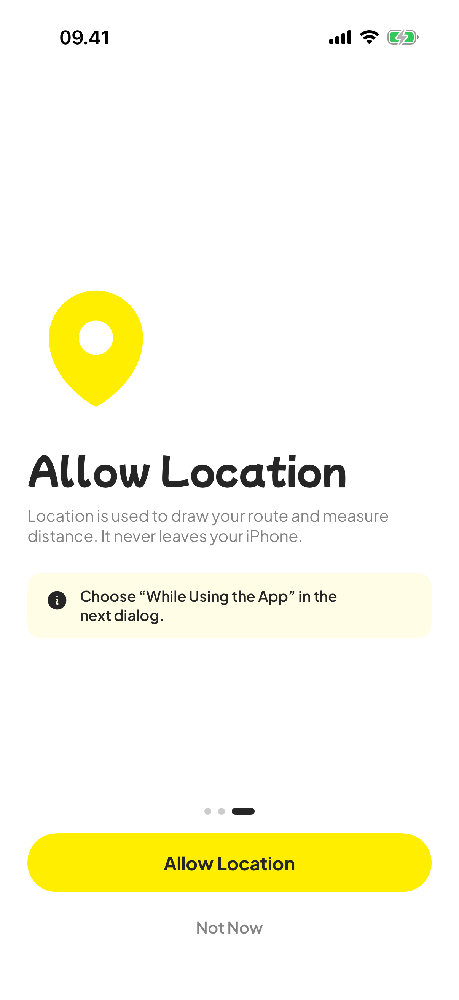
  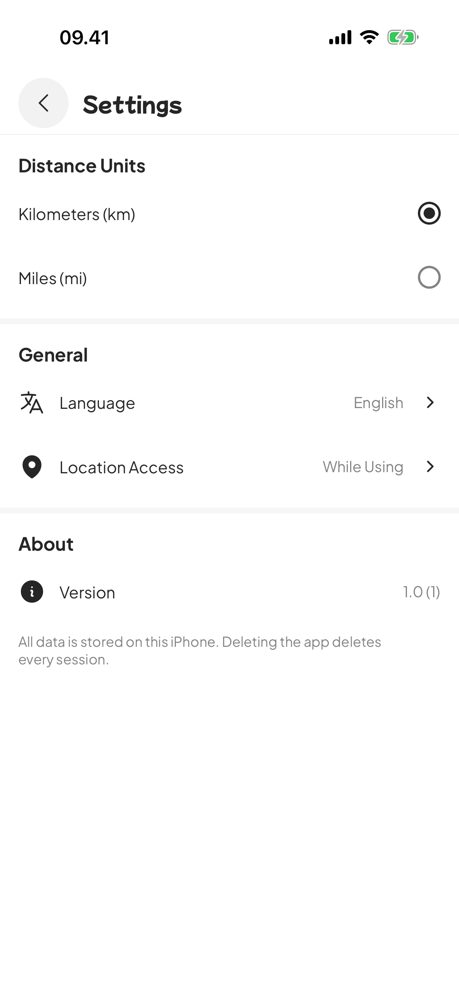
</p>

## Features

- **Run or walk sessions** with a live map, elapsed time, distance, current pace and GPS signal status
- **Pause and resume.** Paused time isn't counted, and no distance is added across the gap.
- **Session summary** with the route colored from slowest to fastest stretch, plus distance, duration, average pace and elevation gain
- **Saved sessions.** The home screen previews your last route, and you can open it in a detail screen or delete it.
- **Background tracking**, so recording continues while the screen is locked
- **Onboarding** that explains location access and handles *Allow Once*, denied and reduced-accuracy permissions
- **Settings** for kilometers or miles, language, and a shortcut to location permissions
- **English and Bahasa Indonesia**
- **Light and dark appearance**, Dynamic Type-aware fonts and Reduce Motion support
- **Adaptive layouts** for regular iPhones and for foldables, with a single column when closed and a two-panel split across the hinge when open

## Foldable support

Jejak adapts to the iPhone Duo in both postures. [`ScreenLayout`](Jejak/Core/DesignSystem/ScreenLayout.swift) picks a layout from the screen's shape and size class. When you fold or unfold the phone mid-session, the app animates between layouts (with a simpler fade when Reduce Motion is on).

**Closed (outer screen):** a single column with tighter sizing. The status bar is hidden so content clears the rounded corners.

<p align="center">
  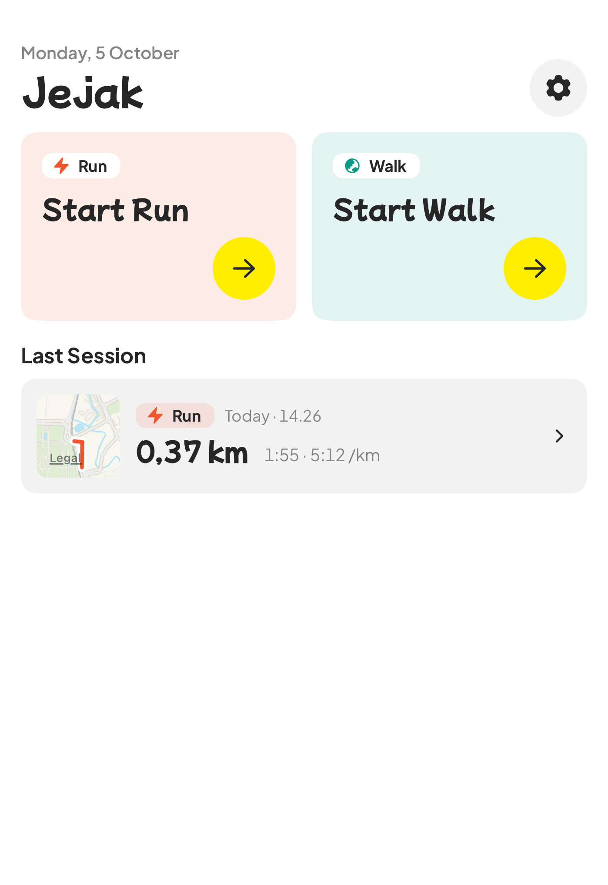
  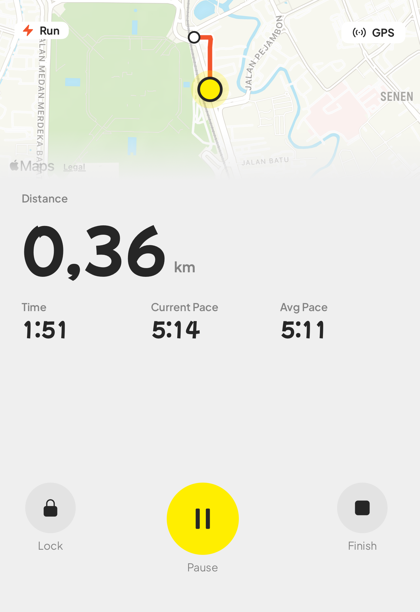
  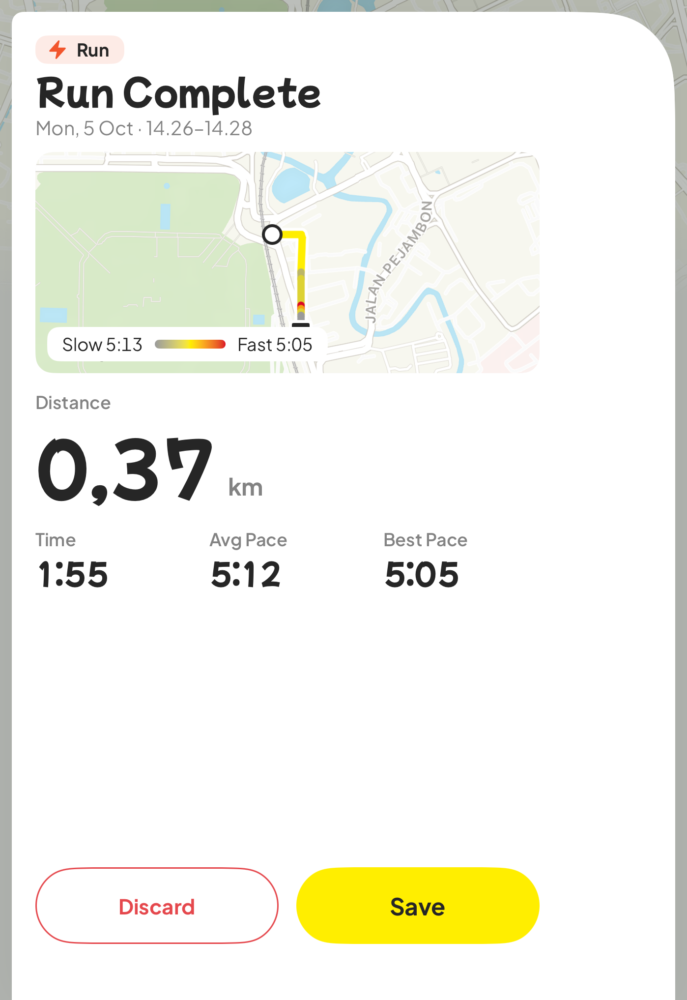
</p>

**Open (inner screen):** two panels that split exactly on the hinge, with context on the left and content and actions on the right.

<p align="center">
  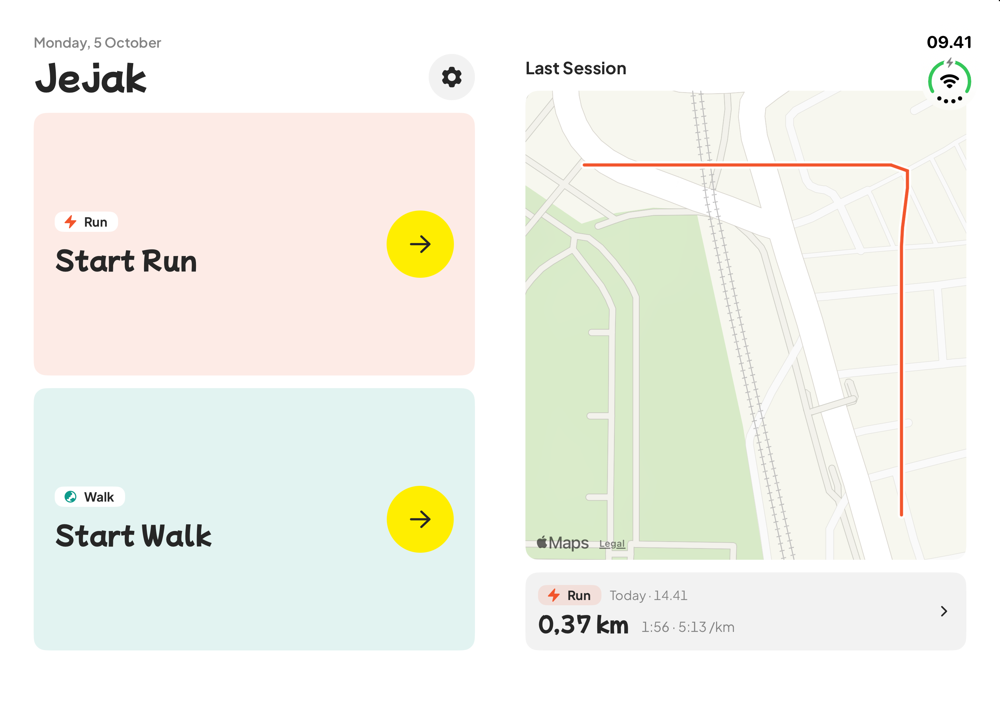
  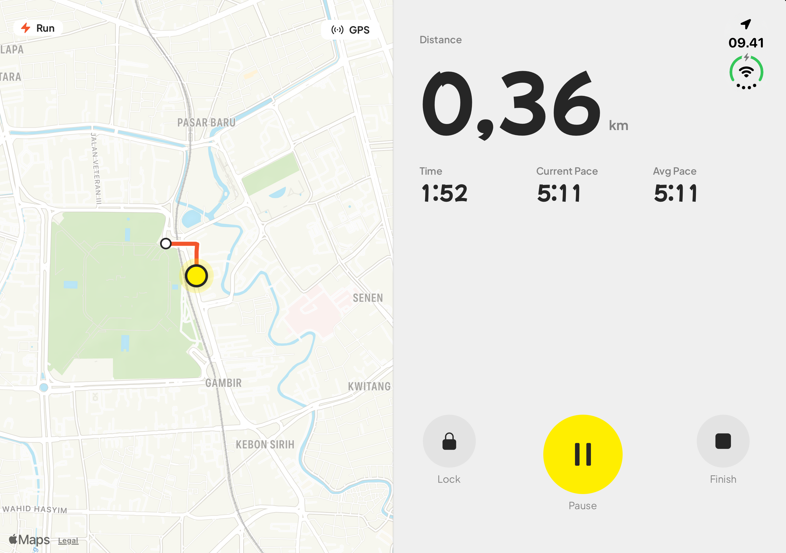
</p>
<p align="center">
  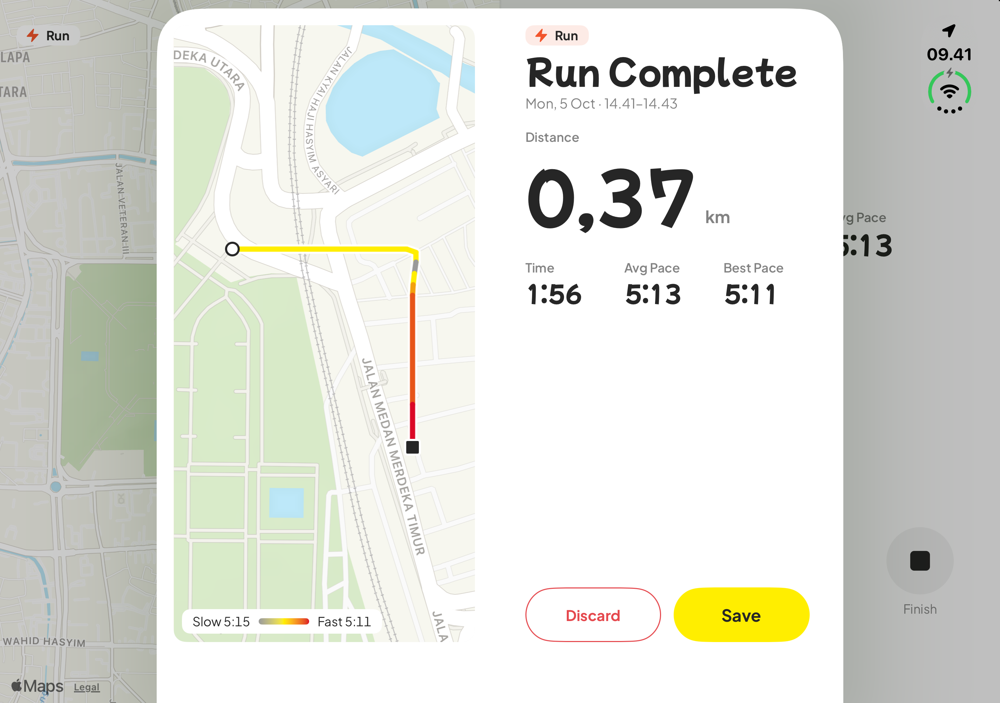
  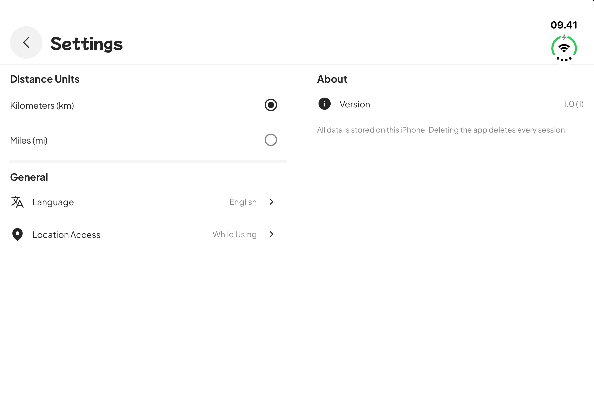
</p>

## How the tracking works

Every location fix goes through the same pipeline in [`SessionRecorder`](Jejak/Features/Session/Domain/Entities/SessionRecorder.swift):

```
raw fix ─▶ quality check ─▶ Kalman filter + outlier gate ─▶ stop detection ─▶ route point & distance
                                                                 │
                         raw fix kept as-is (for replay) ◀───────┘
```

1. **Quality check.** Fixes with horizontal accuracy worse than 65 m are dropped. Weak fixes that are still usable are marked as estimated.
2. **Kalman filter** ([`TrackFilter`](Jejak/Features/Session/Domain/Entities/TrackFilter.swift)). A constant-velocity model works in meters on a plane tangent to the first fix. It fuses position with the device's Doppler speed and course when they're available.
3. **Outlier rejection.** A fix is rejected when it implies a speed faster than the activity allows, even after allowing for its full error radius. It's also rejected when its Mahalanobis distance from the prediction exceeds the χ² 99.9% gate. After several rejections in a row, the app trusts GPS again so it can't lock onto a wrong estimate.
4. **Motion profiles** ([`MotionProfile`](Jejak/Features/Session/Domain/Entities/MotionProfile.swift)). Running and walking get different settings for maximum speed, acceleration noise, stop and start thresholds, and point spacing.
5. **Stop detection.** When the estimated speed drops, the runner counts as stopped. GPS wander around the stop then adds no distance until they clearly move away from it.
6. **Elevation** ([`Elevation.swift`](Jejak/Features/Session/Domain/Entities/Elevation.swift)). A separate 1-D Kalman filter smooths altitude. Climbing only counts once it rises above a threshold, so leftover noise doesn't add up to fake elevation gain.
7. **Raw track replay.** Every raw fix is saved next to the session. That means old sessions can be reprocessed later with an improved algorithm.

## Architecture

Jejak uses Clean Architecture, with one folder per feature and dependency injection through [Swinject](https://github.com/Swinject/Swinject).

```
Jejak/
├── App/                    # Entry point and root view (onboarding gate)
├── Core/
│   ├── DI/                 # DIContainer: one Swinject Assembly per feature
│   └── DesignSystem/       # Colors, fonts, buttons, sheets, icons, ScreenLayout
├── Features/
│   ├── Onboarding/
│   ├── Home/
│   ├── Session/
│   └── Settings/
│       ├── Domain/         # Entities, repository protocols, use cases (no UIKit or SwiftUI)
│       ├── Data/           # Repository and service implementations
│       ├── Presentation/   # Views, components and @Observable view models
│       └── *Assembly.swift # Wires the feature into the container
└── Resources/              # Localizable.xcstrings, bundled fonts
```

- **Domain** holds pure Swift value types and logic. The tracking pipeline lives here, so it's fully unit-testable.
- **Data** wraps Core Location (`CLLocationManager`, permission streams), `UserDefaults`, and on-device JSON storage in Application Support, written with complete file protection.
- **Presentation** uses SwiftUI with `@Observable` view models that are resolved from the container.

## Tech stack

| | |
|---|---|
| Language | Swift |
| UI | SwiftUI, MapKit |
| Location | Core Location, with background location updates |
| DI | Swinject 2.10 (Swift Package Manager) |
| Persistence | JSON files in Application Support, plus `UserDefaults` |
| Testing | Swift Testing |
| Localization | String Catalog (English, Bahasa Indonesia) |
| Design | Mochiy Pop One and Plus Jakarta Sans, [Heroicons](https://heroicons.com) |

## Getting started

**Requirements:** Xcode 27.1 or later, and iOS 17.0 or later.

```bash
git clone <repo-url>
cd Jejak
open Jejak.xcodeproj
```

Xcode resolves the Swinject package automatically. Select the **Jejak** scheme, then build and run.

> **Tip:** For real GPS behavior, run on a device. In the Simulator, use **Features → Location → City Run** or **Freeway Drive** to feed a moving route.

## Tests

The tests use Swift Testing and focus on the tracking logic with synthetic GPS tracks. They cover:

- accumulating distance, and leaving out the gap across a pause
- dropping imprecise, jittery and impossible fixes, including a GPS spike in the middle of a run
- adding no distance while standing still or waiting at a traffic light
- following corners without cutting them
- measuring a noisy run close to its true distance
- telling moving from standing still using Doppler speed
- replaying a raw track to exactly the same result
- elevation gain thresholds, recent pace and fastest/slowest stretches
- view model rules: paused time, minimum session length, weak signal
- session storage: save, reload, delete, and backward-compatible decoding

Run them with **⌘U** in Xcode, or from the command line:

```bash
xcodebuild test -project Jejak.xcodeproj -scheme Jejak \
  -destination 'platform=iOS Simulator,name=iPhone 17 Pro'
```

## Privacy

Jejak doesn't send your location anywhere. Sessions and raw tracks stay only on your device, in the app's Application Support folder. Deleting a session also deletes its raw track.

## Author

Muhammad Azri
